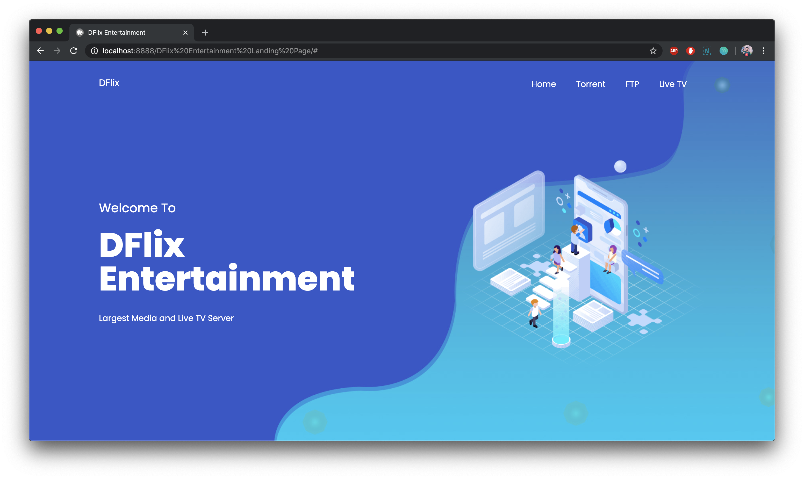

<!-- PROJECT LOGO -->
 

  
  <h3 align="center">DFlix Entertainment Landing Page</h3>
  

    Media and Live TV Server by DOT Internet
     
     
    <a href="https://github.com/othneildrew/Best-README-Template">View Demo</a>
     
     
    
  

<!-- LICENSE -->
## License

Distributed under the MIT License. See `LICENSE` for more information.

<!-- CONTACT -->
## Contact

Name - [Rafat Hossain](https://facebook.com/rafat.hossain.12) - sayhi@rafat.me

Project Link: [https://github.com/afathossain96/DFlix-Entertainment-Landing-Page](https://github.com/afathossain96/DFlix-Entertainment-Landing-Page)

<!-- MARKDOWN LINKS & IMAGES -->
<!-- https://www.markdownguide.org/basic-syntax/#reference-style-links -->
[contributors-shield]: https://img.shields.io/github/contributors/othneildrew/Best-README-Template.svg?style=flat-square
[contributors-url]: https://github.com/rafathossain96/DFlix-Entertainment-Landing-Page/graphs/contributors
[issues-shield]: https://img.shields.io/github/issues/othneildrew/Best-README-Template.svg?style=flat-square
[issues-url]: https://github.com/rafathossain96/DFlix-Entertainment-Landing-Page/issues
[license-shield]: https://img.shields.io/github/license/othneildrew/Best-README-Template.svg?style=flat-square
[license-url]: https://github.com/rafathossain96/DFlix-Entertainment-Landing-Page/blob/master/LICENSE.txt
[linkedin-shield]: https://img.shields.io/badge/-LinkedIn-black.svg?style=flat-square&logo=linkedin&colorB=555
[linkedin-url]: https://linkedin.com/in/rafathossain
[product-screenshot]: assets/images/screenshot.png
